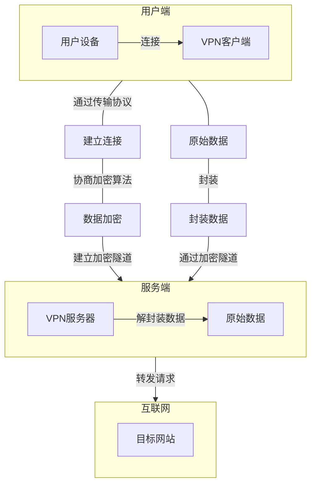
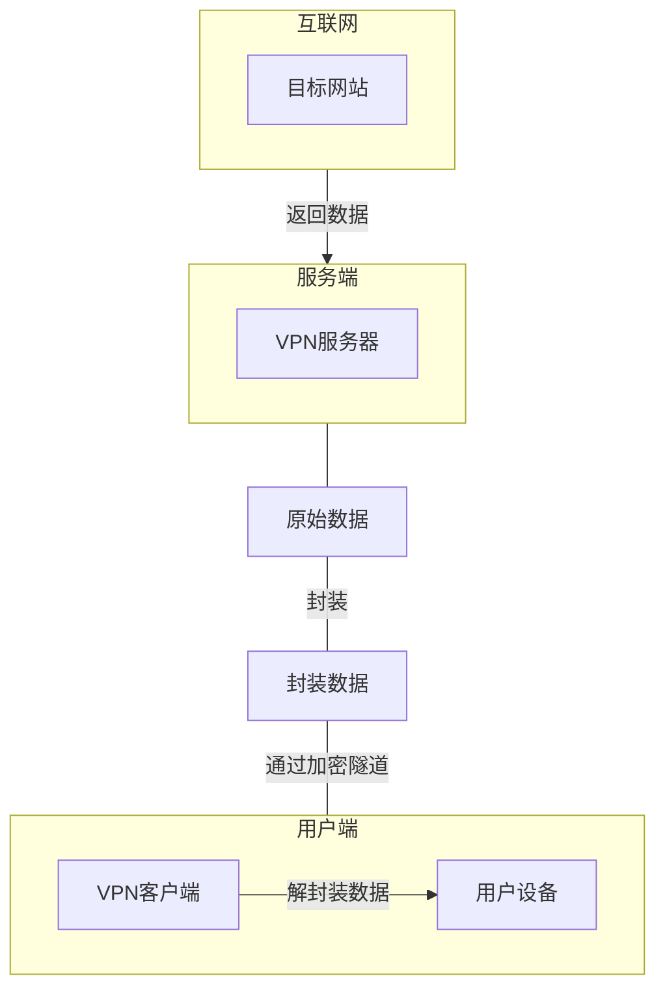
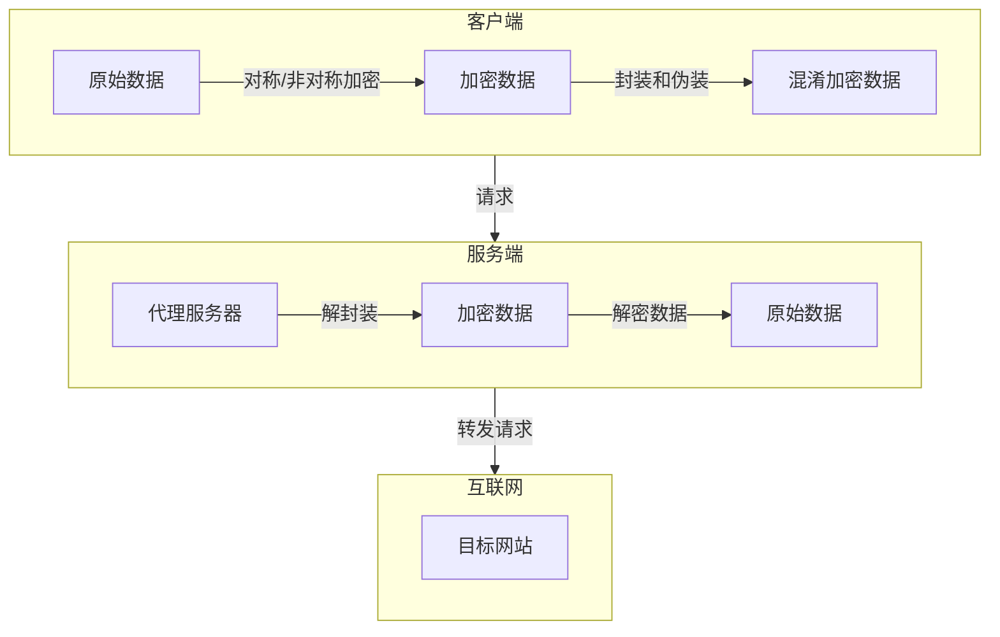
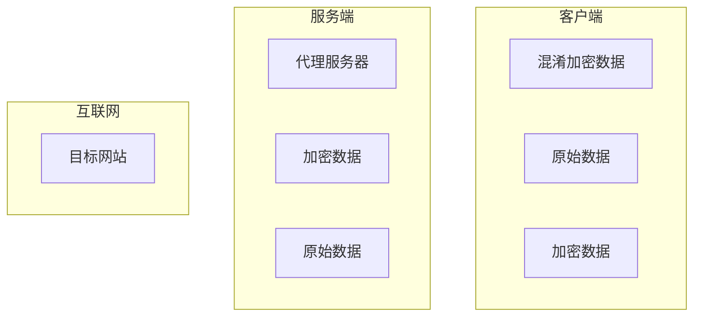

# 
翻墙协议讲解

> [!quote]  别为打翻的牛奶而哭泣

---

# · 协议
在了解翻墙协议之前需要认识和区分两个概念 一个是协议 一个是平台，对于翻墙协议我们可以进行如下区分：

<iframe src="https://flowershow.youzhidanbairu.cloudns.biz/assets/html/%E7%BF%BB%E5%A2%99%E6%B6%89%E5%8F%8A%E5%88%B0%E7%9A%84%E7%BD%91%E7%BB%9C%E5%8D%8F%E8%AE%AE" width="full" height="auto" class="w-full relative pb-[30%] !important"></iframe>
根据协议功能我们可以将它们粗略地分为**加密协议**、**传输协议**、**代理协议**、**以及隧道协议**，它们在翻墙过程中并不是单独运作的，而是协同运作，下面是对它们地逐个介绍：

&nbsp;&nbsp;&nbsp;

# · 翻墙技术的发展史

最古早的翻墙技术是VPN（虚拟专用网络），一般是通过隧道协议和加密协议的结合来实现安全和隐私保护的，然而墙也在不断升级和学习，即使它并不知道你的流量内容或者访问了什么，墙也可以根据流量特征识别出你在翻墙，再进行精准的屏蔽，VPN这种技术实际上已经被淘汰掉了。

而我上面讲到的翻墙协议（也就是你听到过的机场）则是使用到了混淆工具将流量伪装成常见的传输协议流量，增强隐蔽性，是和VPN有着本质区别的。

VPN落幕后，机场协议的鼻祖Shadowsocks 随后脱颖而出，早期的shadowsocks协议确实存在着技术漏洞，涉及到采用非AD的加密的流量的会被主动探测，并且在GFW那里会得到一个百分之百流特征的一个服务服务器反馈。这是个漏洞已经被修正了。Shadowsocks协议目前拥有着最快的RTT，也就是通讯延迟，因为数据包在握手的时候用时最短。后面讲到的V2ray和Trojan在机制的限制下，RTT次数一定比Shadowsocks要多，这一点是无解的。Shadowsocks协议因为机制问题，目前还是体验最好，最简单、最快速，极度体现暴力美学的中转代理方式。Shadowsocks的安全性存在一定风险，但是目前依然是翻墙的主流方式。ShadowsocksR这个协议是Shadowsocks的优化版，但是并非是同一个作者开发的。

不断出现的新起之秀 例如V2ray、Xray、Trojan 、WireGuard、Reality、Hysteria它们也在伴随着墙的升级而进步 并且它们代码开源 拥有一个社区更新和维护
# · 平台
我们现在所用的较为主流的翻墙手段 都是基于翻墙平台所开创的翻墙协议 翻墙平台和协议之间的关系可以参考下面这张图

# · 什么是翻墙平台
翻墙平台是指一整套用于绕过网络审查和访问被限制网站的系统或服务。它通常包括多个组件，每个组件在整个系统中扮演不同的角色，其中包含了翻墙客户端、服务端、核心和协议等多个部分。它提供了用户绕过网络审查的整体解决方案。
# · 翻墙协议之间是如何配合的
这些协议它们并不是单独的 它们在翻墙过程中可以相互配合，形成一个完整的解决方案。下面是一些配合的事例：
1. 加密协议 + 传输协议
- SSL/TLS + TCP: 通过SSL/TLS加密数据，然后使用TCP进行传输。这种组合常用于HTTPS。
- WireGuard + UDP: WireGuard加密数据，然后使用UDP进行传输，提供快速且安全的VPN连接。

2. 加密协议 + 隧道协议
- IKEv2/IPsec + L2TP: IKEv2/IPsec用于加密和验证数据，L2TP用于建立隧道。这种组合常用于VPN连接。
- OpenVPN + SSL/TLS: OpenVPN使用SSL/TLS加密数据，并通过VPN隧道传输。

3. 代理协议 + 传输协议
- SOCKS5 + TCP/UDP: SOCKS5代理可以使用TCP或UDP进行数据传输，适用于多种应用场景。
- HTTP代理 + HTTP/HTTPS: HTTP代理用于代理HTTP或HTTPS流量，常用于浏览器代理设置。

4. 代理协议 + 加密协议
- Shadowsocks + AES: Shadowsocks使用AES加密数据，然后通过代理服务器传输，隐藏真实IP。
- Trojan + TLS: Trojan使用TLS加密数据，伪装成HTTPS流量，防止被检测。

5. 混淆工具 + 传输协议
- Obfsproxy + TCP/UDP: Obfsproxy混淆流量特征，然后通过TCP或UDP传输，防止流量被检测。
- meek + HTTPS: meek伪装流量成普通的HTTPS流量，通过HTTPS传输，隐藏真实流量。
# 
由此迎来结束

祝冲浪愉快

> [!example] 相关文章
