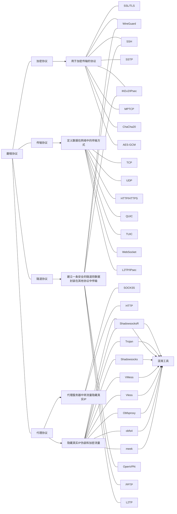

# 
翻墙协议讲解

> [!quote]  别为打翻的牛奶而哭泣

---

# · 协议
在了解翻墙协议之前需要认识和区分两个概念 一个是**协议** 一个是**平台**，对于翻墙协议我们可以进行如下区分：

    

      <h3>--- 查看详解 ---</h3>
    

### 加密协议
1. **SSL/TLS**:
   - **原理**: SSL（Secure Sockets Layer）和TLS（Transport Layer Security）通过加密数据传输来保护互联网通信的安全。它们使用对称加密和非对称加密相结合的方式，确保数据在传输过程中不被窃取或篡改。
   - **工作机制**: 客户端和服务器首先通过非对称加密（如RSA）交换密钥，然后使用对称加密（如AES）进行数据传输。

2. **WireGuard**:
   - **原理**: WireGuard是一种现代化的VPN协议，使用高效的加密算法（如ChaCha20）来确保数据的安全性和传输速度。
   - **工作机制**: 它通过预共享密钥和公钥加密来建立安全连接，简化了配置和管理。

3. **SSH**:
   - **原理**: SSH（Secure Shell）用于安全登录和数据传输，通过加密通信防止数据被窃听。
   - **工作机制**: 使用公钥加密进行身份验证，并通过对称加密（如AES）保护数据传输。

4. **SSTP**:
   - **原理**: SSTP（Secure Socket Tunneling Protocol）由微软开发，结合了SSL/TLS的安全性和VPN的功能。
   - **工作机制**: 使用SSL/TLS加密数据传输，确保数据在公共网络上的安全。

5. **IKEv2/IPsec**:
   - **原理**: IKEv2（Internet Key Exchange version 2）和IPsec（Internet Protocol Security）常用于VPN连接，提供高安全性和稳定性。
   - **工作机制**: IKEv2负责密钥交换和安全策略协商，IPsec负责加密和验证数据包。

6. **MPTCP**:
   - **原理**: MPTCP（Multipath TCP）允许在多个路径上同时传输数据，提高连接的可靠性和速度。
   - **工作机制**: 将数据分割成多个子流，通过不同的路径传输，然后在接收端重新组装。

7. **ChaCha20**:
   - **原理**: ChaCha20是一种快速且安全的流加密算法，适用于高性能需求的场景。
   - **工作机制**: 使用一个密钥和一个随机数生成伪随机数流，然后与数据进行异或运算来加密数据。

8. **AES-GCM**:
   - **原理**: AES-GCM（Advanced Encryption Standard Galois/Counter Mode）是一种高效且安全的加密模式，结合了加密和认证。
   - **工作机制**: 使用AES进行加密，并通过GCM模式提供数据完整性验证。

### 传输协议
1. **TCP**:
   - **原理**: TCP（Transmission Control Protocol）提供可靠的数据传输，通过确认和重传机制确保数据完整性。
   - **工作机制**: 建立连接（三次握手），传输数据，确认接收，关闭连接（四次挥手）。

2. **UDP**:
   - **原理**: UDP（User Datagram Protocol）提供不可靠的数据传输，适用于对速度要求高但对可靠性要求低的场景。
   - **工作机制**: 直接发送数据包，不进行确认和重传。

3. **HTTP/HTTPS**:
   - **原理**: HTTP（Hypertext Transfer Protocol）用于传输网页数据，HTTPS（HTTP Secure）通过SSL/TLS加密HTTP数据。
   - **工作机制**: 客户端发送请求，服务器响应请求，传输数据。

4. **QUIC**:
   - **原理**: QUIC（Quick UDP Internet Connections）由谷歌开发，结合了TCP的可靠性和UDP的速度。
   - **工作机制**: 使用UDP传输数据，并通过内置的加密和重传机制确保数据可靠性。

5. **TUIC**:
   - **原理**: TUIC是一种新的传输协议，具体信息较少，但可能结合了多种传输和加密技术。
   - **工作机制**: 可能类似于QUIC，提供快速和安全的数据传输。

6. **WebSocket**:
   - **原理**: WebSocket用于实时通信，提供双向数据传输。
   - **工作机制**: 建立持久连接，客户端和服务器可以随时发送数据。

7. **L2TP/IPsec**:
   - **原理**: L2TP（Layer 2 Tunneling Protocol）与IPsec结合使用，提供安全的VPN连接。
   - **工作机制**: L2TP负责建立隧道，IPsec负责加密和验证数据。

### 代理协议
1. **SOCKS5**:
   - **原理**: SOCKS5是一种通用的代理协议，支持多种网络协议。
   - **工作机制**: 客户端通过代理服务器中转流量，隐藏真实IP。

2. **HTTP**:
   - **原理**: HTTP代理用于代理HTTP流量。
   - **工作机制**: 客户端通过代理服务器发送HTTP请求，代理服务器转发请求并返回响应。

3. **ShadowsocksR**:
   - **原理**: ShadowsocksR是一种具有混淆功能的代理协议，防止流量被检测和封锁。
   - **工作机制**: 使用加密和混淆技术隐藏流量特征。

4. **Trojan**:
   - **原理**: Trojan是一种具有混淆功能的代理协议，伪装成HTTPS流量。
   - **工作机制**: 使用TLS加密和混淆技术隐藏流量。

5. **Shadowsocks**:
   - **原理**: Shadowsocks是一种轻量级的代理协议，提供加密和混淆功能。
   - **工作机制**: 使用对称加密和混淆技术保护流量。

6. **VMess**:
   - **原理**: VMess是V2Ray的核心协议，提供加密和混淆功能。
   - **工作机制**: 使用对称加密和混淆技术保护流量。

7. **Vless**:
   - **原理**: Vless是V2Ray的轻量级协议，提供加密和混淆功能。
   - **工作机制**: 使用对称加密和混淆技术保护流量。

8. **Obfsproxy**:
   - **原理**: Obfsproxy是一种流量混淆工具，防止流量被检测。
   - **工作机制**: 使用混淆技术隐藏流量特征。

9. **obfs4**:
   - **原理**: obfs4是一种流量混淆工具，防止流量被检测。
   - **工作机制**: 使用混淆技术隐藏流量特征。

10. **meek**:
    - **原理**: meek是一种流量伪装工具，通过伪装成普通HTTPS流量来隐藏真实流量。
    - **工作机制**: 使用TLS加密和伪装技术隐藏流量。

### 隧道协议
1. **OpenVPN**:
   - **原理**: OpenVPN是一种开源的VPN协议，使用SSL/TLS加密数据传输。
   - **工作机制**: 建立加密隧道，通过VPN服务器中转流量。

2. **SSH**:
   - **原理**: SSH也可以用于建立安全隧道，保护数据传输。
   - **工作机制**: 使用公钥加密进行身份验证，并通过对称加密保护数据传输。

3. **IKEv2/IPsec**:
   - **原理**: IKEv2/IPsec常用于VPN连接，提供高安全性和稳定性。
   - **工作机制**: IKEv2负责密钥交换和安全策略协商，IPsec负责加密和验证数据包。

4. **PPTP**:
   - **原理**: PPTP（Point-to-Point Tunneling Protocol）是一种较老的VPN协议，安全性较低。
   - **工作机制**: 建立隧道，通过VPN服务器中转流量。

5. **L2TP**:
   - **原理**: L2TP与IPsec结合使用，提供安全的VPN连接。
   - **工作机制**: L2TP负责建立隧道，IPsec负责加密和验证数据。

6. **WireGuard**:
   - **原理**: WireGuard是一种现代化的VPN协议，使用高效的加密算法（如ChaCha20）来确保数据的安全性和传输速度。
   - **工作机制**: 通过预共享密钥和公钥加密来建立安全连接，简化了配置和管理。

希望这些详细的解释能帮助你更好地理解这些协议的原理和工作机制！如果你有任何具体的问题或需要进一步的解释，请随时告诉我。

以上这幅图是否十分劝退 别着急 这只是要引出我下面要讲的东西 这个部分才是关键 先耐心看下去 
# · 翻墙技术的发展史

最古早的翻墙技术是VPN（虚拟专用网络），一般是通过**隧道协议**和**加密协议**的结合来实现安全和隐私保护的。然而墙除了阻止，还有学习的能力，即使你的加密达到完美，墙也可以根据流量特征识别出你在翻墙，进行精准的屏蔽，这种技术现在已经过时被淘汰

而我上面讲到的翻墙协议（也就是你听到过的机场）则是使用到了混淆工具将流量伪装成常见的传输协议流量，以便绕过网络审查和增强隐蔽性，是和VPN技术有着本质区别的。

VPN落幕后，机场协议的鼻祖Shadowsocks 随后脱颖而出，早期的shadowsocks协议确实存在着技术漏洞，涉及到采用非AD的加密的流量的会被主动探测，并且在GFW那里会得到一个百分之百流特征的一个服务服务器反馈。这是个漏洞已经被修正了。Shadowsocks协议目前拥有着最快的RTT，也就是通讯延迟，因为数据包在握手的时候用时最短。后面讲到的V2ray和Trojan在机制的限制下，RTT次数一定比Shadowsocks要多，这一点是无解的。Shadowsocks协议因为机制问题，目前还是体验最好，最简单、最快速，极度体现暴力美学的中转代理方式。Shadowsocks的安全性存在一定风险，但是目前依然是翻墙的主流方式。ShadowsocksR这个协议是Shadowsocks的优化版，但是并非是同一个作者开发的。

随后是不断的新起之秀 例如V2ray Xray Trojan  WireGuard 它们也在伴随着墙的升级而进步 并且它们代码开源 拥有一个社区更新和维护
# · 平台
我们现在所用的较为主流的翻墙手段 都是基于翻墙平台所开创的加密协议 由于翻墙平台和协议的关系可以参考下面这张图

# · 什么是翻墙平台
翻墙平台是指一整套用于绕过网络审查和访问被限制网站的系统或服务。它通常包括多个组件，每个组件在整个系统中扮演不同的角色，其中包含了翻墙客户端、服务端、核心和协议等多个部分。它提供了用户绕过网络审查的整体解决方案。
# · 翻墙协议之间是如何配合的
这些协议它们并不是单独的 它们在翻墙过程中可以相互配合，形成一个完整的解决方案。下面是一些配合的事例：
1. **加密协议 + 传输协议**
- **SSL/TLS + TCP**: 通过SSL/TLS加密数据，然后使用TCP进行传输。这种组合常用于HTTPS。
- **WireGuard + UDP**: WireGuard加密数据，然后使用UDP进行传输，提供快速且安全的VPN连接。

2. **加密协议 + 隧道协议**
- **IKEv2/IPsec + L2TP**: IKEv2/IPsec用于加密和验证数据，L2TP用于建立隧道。这种组合常用于VPN连接。
- **OpenVPN + SSL/TLS**: OpenVPN使用SSL/TLS加密数据，并通过VPN隧道传输。

3. **代理协议 + 传输协议**
- **SOCKS5 + TCP/UDP**: SOCKS5代理可以使用TCP或UDP进行数据传输，适用于多种应用场景。
- **HTTP代理 + HTTP/HTTPS**: HTTP代理用于代理HTTP或HTTPS流量，常用于浏览器代理设置。

4. **代理协议 + 加密协议**
- **Shadowsocks + AES**: Shadowsocks使用AES加密数据，然后通过代理服务器传输，隐藏真实IP。
- **Trojan + TLS**: Trojan使用TLS加密数据，伪装成HTTPS流量，防止被检测。

5. **混淆工具 + 传输协议**
- **Obfsproxy + TCP/UDP**: Obfsproxy混淆流量特征，然后通过TCP或UDP传输，防止流量被检测。
- **meek + HTTPS**: meek伪装流量成普通的HTTPS流量，通过HTTPS传输，隐藏真实流量。
# 
由此迎来结束

祝冲浪愉快

> [!example] 相关文章
