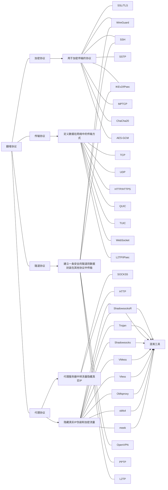

# 翻墙协议讲解

---
在了解翻墙协议之前需要认识和区分两个概念 一个是协议 一个是平台

# 协议
对于翻墙协议我们可以进行如下区分

详解

加密协议

传输协议

代理协议

隧道协议

以上这幅图是否十分劝退 别着急 这只是要引出我下面要讲的东西 这个部分才是关键 先耐心看下去 
# 翻墙技术的发展史

最古早的翻墙技术是VPN（虚拟专用网络），一般是通过**隧道协议**和**加密协议**的结合来实现安全和隐私保护的。然而墙除了阻止，还有学习的能力，即使你的加密达到完美，墙也可以根据流量特征识别出你在翻墙，进行精准的屏蔽，这种技术现在已经过时被淘汰

而我上面讲到的翻墙协议（也就是你听到过的机场）则是使用到了混淆工具将流量伪装成常见的传输协议流量，以便绕过网络审查和增强隐蔽性，是和VPN技术有着本质区别的。

VPN落幕后，机场协议的鼻祖Shadowsocks 随后脱颖而出，早期的shadowsocks协议确实存在着技术漏洞，涉及到采用非AD的加密的流量的会被主动探测，并且在GFW那里会得到一个百分之百流特征的一个服务服务器反馈。这是个漏洞已经被修正了。Shadowsocks协议目前拥有着最快的RTT，也就是通讯延迟，因为数据包在握手的时候用时最短。后面讲到的V2ray和Trojan在机制的限制下，RTT次数一定比Shadowsocks要多，这一点是无解的。Shadowsocks协议因为机制问题，目前还是体验最好，最简单、最快速，极度体现暴力美学的中转代理方式。Shadowsocks的安全性存在一定风险，但是目前依然是翻墙的主流方式。ShadowsocksR这个协议是Shadowsocks的优化版，但是并非是同一个作者开发的。

随后是不断的新起之秀 例如V2ray Xray Trojan  WireGuard 它们也在伴随着墙的升级而进步 并且它们代码开源 拥有一个社区更新和维护
# 平台
我们现在所用的较为主流的翻墙手段 都是基于翻墙平台所开创的加密协议 由于翻墙平台和协议的关系可以参考下面这张图

那么什么又是翻墙协议呢

方案的利弊和选择

这些协议它们并不是单独的 它们在翻墙过程中可以相互配合，形成一个完整的解决方案。

