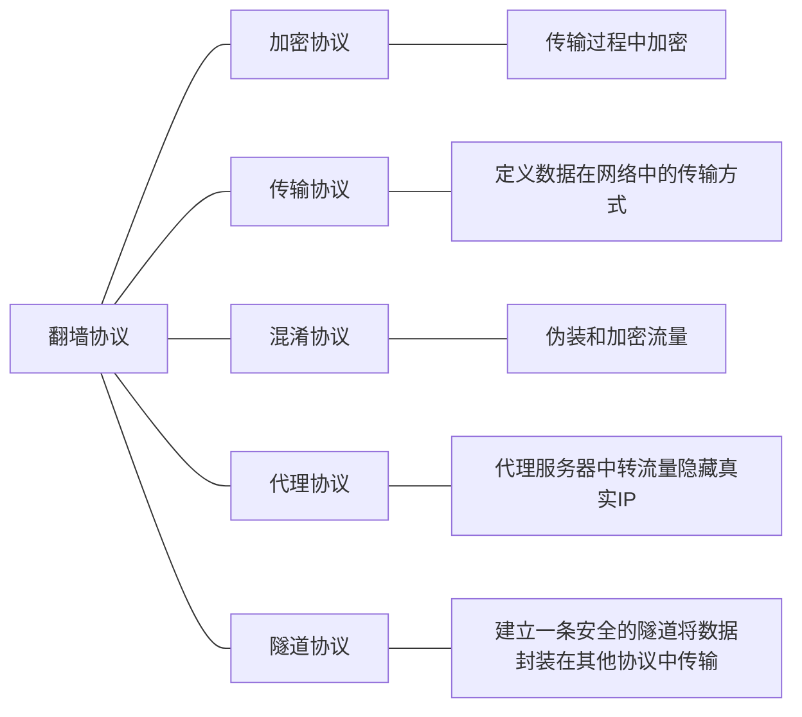

# 翻墙协议讲解

在了解翻墙协议之前需要认识和区分两个概念 一个是协议 一个是平台

对于翻墙协议我们可以进行如下区分

这些协议它们并不是单独的 它们在翻墙过程中可以相互配合，形成一个完整的解决方案。同时我们也可以区分出独立的翻墙协议和其他翻墙协议来

它们之间是如下方式配合的

假设我们有一个客户端需要通过一个安全的通道访问一个远程服务器，以下是一个可能的配合方案：
1. **客户端**首先使用**加密协议**（如TLS）对数据进行加密。
2. 加密后的数据通过**传输协议**（如TCP）发送到**混淆服务器**。
3. **混淆服务器**使用**混淆协议**（如Obfsproxy）对数据进行混淆处理。
4. 混淆后的数据通过**传输协议**发送到**代理服务器**。
5. **代理服务器**使用**代理协议**（如SOCKS5）转发数据。
6. 代理后的数据通过**隧道协议**（如OpenVPN）创建的隧道发送到**远程服务器**。

什么是翻墙平台

我们现在所用的基本所有翻墙协议 包括机场 都是基于翻墙平台及社区维护的翻墙平台所开创的加密协议 它们在github上开源 是可供给所有人审查和贡献的项目

翻墙平台存在的包含关系

方案的利弊和选择

