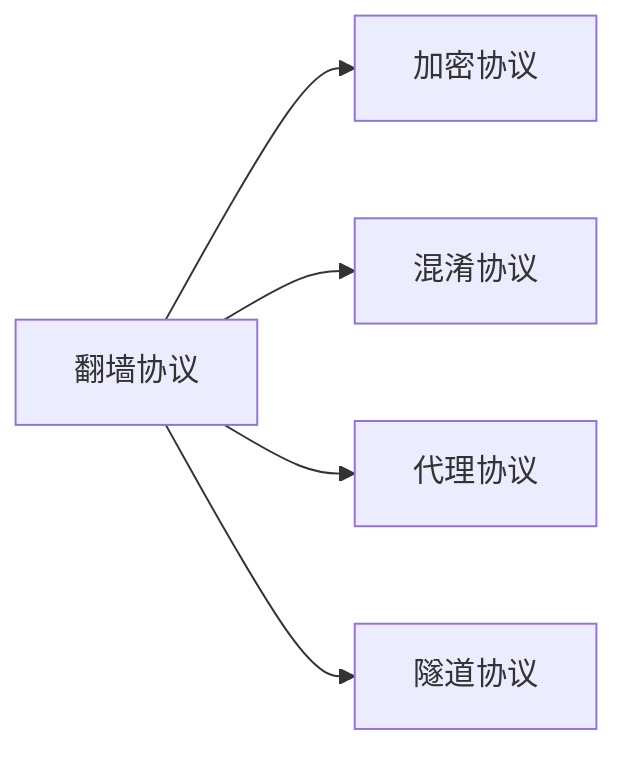

翻墙协议讲解

在了解翻墙协议之前需要理清两个概念 一个是对于翻墙协议的区分，一个是对于翻墙平台的认识 

对于翻墙协议按照功能我们可以如下区分：

```mermaid
flowchart LR
翻墙协议 --> 传输协议
翻墙协议 --> 混淆协议
翻墙协议 --> 代理协议
翻墙协议 --> 隧道协议

```
按照协议工作原理可以按如下区分：

```mermaid
flowchart LR
翻墙协议 --> 加密协议
翻墙协议 --> 混淆协议
翻墙协议 --> 代理协议
翻墙协议 --> 隧道协议
```

我们现在所用的基本所有翻墙协议 包括机场 
都是基于翻墙平台及社区维护的翻墙平台所开创的加密协议 它们在github上开源 是可供给所有人审查和贡献的项目

