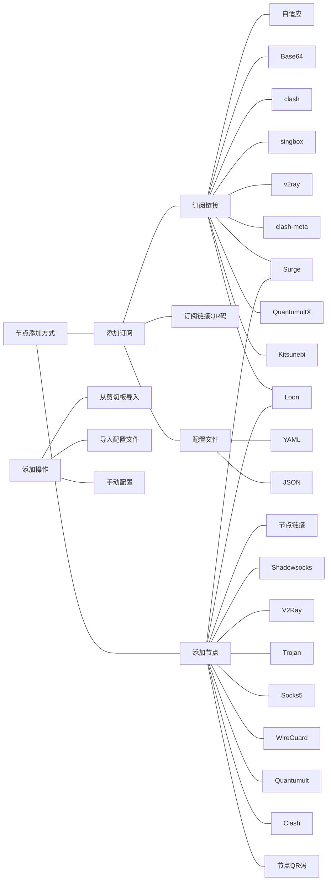

# 
订阅格式及使用

> [!quote]

---
添加节点或订阅的方式

    

      <h3>--- 不同订阅格式特征 ---</h3>
    

Shadowsocks 节点链接：通常以 ss:// 开头，包含加密方式、密码和服务器地址等信息。

V2Ray 节点链接：通常以 vmess:// 开头，包含 UUID、加密方式、服务器地址和端口等信息。

Trojan 节点链接：通常以 trojan:// 开头，包含密码、服务器地址和端口等信息。

Socks5 节点链接：通常以 socks5:// 开头，包含服务器地址、端口、用户名和密码等信息。

WireGuard 节点链接：通常以 wg:// 开头，包含公钥、私钥、服务器地址和端口等信息。

Quantumult 节点链接：适用于 Quantumult 应用，通常以 quantumult:// 开头，包含服务器地址、端口、加密方式等信息。

Surge 节点链接：适用于 Surge 应用，通常以 surge:// 开头，包含服务器地址、端口、加密方式等信息。

Loon 节点链接：适用于 Loon 应用，通常以 loon:// 开头，包含服务器地址、端口、加密方式等信息。

Clash 节点链接：适用于 Clash 应用，通常以 clash:// 开头，包含服务器地址、端口、加密方式等信息。

订阅和节点的区别

